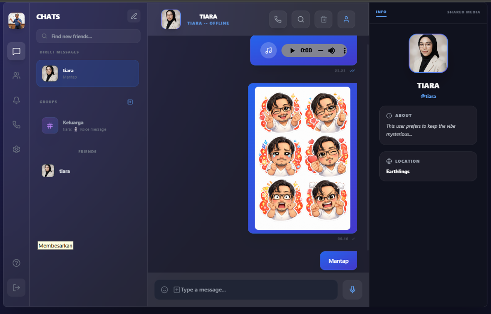
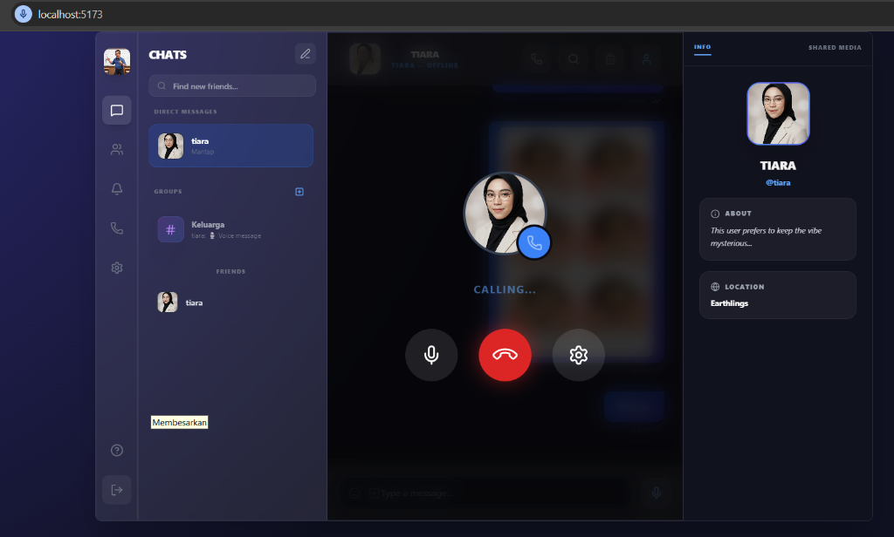

Ismi 
# 🚀 Social Messaging Web App v2

Aplikasi pesan sosial modern berbasis web yang fokus pada kecepatan, keamanan, dan pengalaman pengguna yang interaktif (Real-time).

 

---

## 📸 Screenshot

|                    Chat View                     |                 Voice Call View                  |
| :----------------------------------------------: | :----------------------------------------------: |
|  |  |

---

## ✨ Fitur Utama

-   **💬 Real-time Messaging:** Kirim dan terima pesan instan tanpa refresh (Socket.io).
-   **📞 Voice Call 1-on-1:** Panggilan suara jernih menggunakan teknologi WebRTC (Peer-to-Peer).
-   **🔔 Ringtone & Notifikasi:** Nada dering kustom dan notifikasi suara saat pesan masuk atau telepon berdering.
-   **👥 Group Chat:** Buat grup, undang teman, dan ngobrol rame-rame.
-   **📁 Berbagi File:** Kirim gambar, audio, dan dokumen dengan mudah.
-   **😄 Reaksi Emoji:** Berikan reaksi cepat pada pesan teman.
-   **🎨 Glassmorphism UI:** Desain antarmuka modern yang estetik dan responsif.
-   **🔐 Aman:** Enkripsi password (Bcrypt) dan autentikasi JWT.

---

## 🛠️ Teknologi yang Digunakan

### Frontend
-   **React.js (Vite):** Untuk performa UI yang super cepat.
-   **TailwindCSS:** Styling modern dan responsif.
-   **Framer Motion:** Animasi UI yang halus.
-   **WebRTC:** Protokol komunikasi audio/video real-time.

### Backend
-   **Node.js & Express:** Server API yang tangguh.
-   **Socket.io:** Engine komunikasi real-time (WebSocket).
-   **SQLite:** Database ringan, serverless, dan cepat (`better-sqlite3`).
-   **Swagger:** Dokumentasi API interaktif.

---

## 📚 Dokumentasi Proyek

Untuk detail teknis lebih lanjut, silakan baca dokumen berikut yang tersedia di dalam proyek:

1.  **[📖 Dokumentasi API](./API_DOCUMENTATION.md)**: Panduan lengkap endpoint REST API dan Event Socket.io.
2.  **[🏗️ Arsitektur Sistem](./ARCHITECTURE.md)**: Penjelasan desain sistem, alur data, dan struktur database.
3.  **[🚀 Peta Jalan (Roadmap)](./FUTURE_ROADMAP.md)**: Rencana pengembangan fitur masa depan (Video Call, dll).
4.  **[📄 Swagger UI](http://localhost:3001/api-docs)**: Coba langsung API di browser (saat server berjalan).

---

## ⚙️ Cara Menjalankan

Ikuti langkah-langkah ini untuk menjalankan proyek di komputer lokal Anda:

### 1. Persiapan
Pastikan **Node.js** sudah terinstal di komputer Anda.

### 2. Instalasi Dependensi
Buka terminal di folder proyek dan jalankan:
```bash
npm install
```

### 3. Menjalankan Server (Backend)
Buka terminal baru, lalu jalankan:
```bash
node server/index.js
```
*Server akan berjalan di port 3001.*

### 4. Menjalankan Aplikasi (Frontend)
Buka terminal lain, lalu jalankan:
```bash
npm run dev
```
*Aplikasi akan berjalan di http://localhost:5173 (atau sesuai tampilan terminal).*

---

## 📞 Kontak & Kredit

Proyek ini dikembangkan dan dipelihara oleh tim:

| Role          | Nama                        | Kontak                                  |
| :------------ | :-------------------------- | :-------------------------------------- |
| **Developer** | **Bang Ucok & Antigravity** | [WhatsApp](https://wa.me/6281234500747) |
| **Email**     | **emailsinaga@gmail.com**   | -                                       |

---

*Dibuat dengan ❤️ dan Kopi.*
